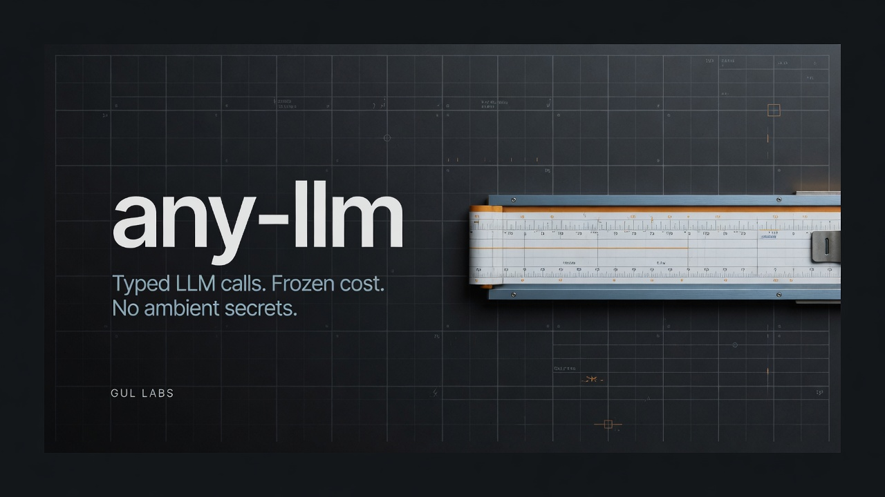

<p align="center">
  
</p>

<h1 align="center">any-llm</h1>

<p align="center">
  In-process TypeScript client for provider-hosted models.<br>
  Typed calls. Frozen micro-USD cost. No ambient secrets.
</p>

<p align="center">
  <a href="https://github.com/GulLabs/any-llm/actions/workflows/ci.yml"></a>
  <a href="https://www.npmjs.com/package/@gullabs/any-llm"></a>
  <a href="./LICENSE"></a>
  <a href="https://www.npmjs.com/package/@gullabs/any-llm"></a>
</p>

A thin adapter over raw provider SDKs. No agent loop, no framework, no magic. Every call goes through one pipeline: validate config → dispatch → normalize usage → price → persist.

| You get                                                | You do not get                          |
| ------------------------------------------------------ | --------------------------------------- |
| Canonical model IDs, rejected when unknown             | Alias maps and silent remaps            |
| Per-call `auth` you pass in                            | `process.env` / ADC / ambient key reads |
| Frozen integer µUSD + `pricingVersion` on every record | Repriced history                        |
| Thinking tokens and optional thought text              | An agent runtime                        |
| Fail-open sink / telemetry / cost                      | A broken logger failing the LLM call    |

## Install

```bash
pnpm add @gullabs/any-llm
```

That one package is the Gemini facade: `@gullabs/core` + `@gullabs/google` + `@google/genai`.

Add other providers yourself. Auth stays host-injected on every call.

```bash
pnpm add @gullabs/core @gullabs/google @gullabs/xai @google/genai openai
# peers: @google/genai for Gemini; openai ^6 || ^7 for xAI Responses (baseURL api.x.ai)
```

## Quickstart

```ts
import {
  createClient,
  composeProviders,
  defineCallSite,
  googleProvider,
} from '@gullabs/any-llm'

const client = createClient({
  ...composeProviders([googleProvider()]),
})

const codeReview = defineCallSite({
  id: 'code-review',
  provider: 'google',
  model: 'gemini-2.5-flash',
  jsonSchema: {
    type: 'object',
    properties: {
      rating: { type: 'number' },
      summary: { type: 'string' },
    },
    required: ['rating', 'summary'],
  },
  system: 'You are a senior code reviewer.',
  userTemplate: 'Review this diff:\n\n{{diff}}',
  config: {
    reasoning: { includeThoughts: true, effort: 'medium' },
    serviceTier: 'flex',
  },
})

const auth = { apiKey: process.env.MY_APP_GEMINI_KEY! }
const result = await client.runStructured(codeReview, { diff: myDiff }, { auth })

console.log(result.output) // unknown; caller validates
console.log(result.outputParsed)
console.log(result.usage) // { inputTokens, outputTokens, cachedInputTokens, thinkingTokens }
console.log(result.cost?.microUsd) // integer µUSD, frozen at call time
console.log(result.reasoningText)
```

Persist records with [`@gullabs/drizzle`](./packages/drizzle) by passing `sink: drizzleUsageSink(db, llmCalls)` to `createClient`.

A network-free walkthrough lives in [`examples/basic.ts`](./examples/basic.ts). Run it with `pnpm example`.

## Multi-provider

```ts
import { createClient, composeProviders } from '@gullabs/core'
import { googleProvider, GoogleFileStore } from '@gullabs/google'
import { xaiProvider, XaiFileStore } from '@gullabs/xai'

const client = createClient({
  ...composeProviders([googleProvider(), xaiProvider()]),
})

await client.generate(
  { provider: 'xai', model: 'grok-4.6', messages: [...] },
  { auth: { apiKey: xaiKey } },
)

const xaiFiles = new XaiFileStore({ auth: { apiKey: xaiKey } })
const geminiFiles = new GoogleFileStore({ auth: { apiKey: geminiKey } })
```

See [`packages/xai/README.md`](./packages/xai/README.md) for `XaiFileStore` / `FileRefPart` and fail-closed delete.

## Auth

The library never reads credentials from the environment or any ambient source. There is no `envAuth()`, no `AuthProvider` port, and no client-level `auth` on `createClient`. Pass `auth` on every call:

```ts
client.generate(request, { auth: { apiKey } })
client.runStructured(callSite, { auth: { apiKey } })
```

`AuthMaterial` is `{ apiKey: string, keyId?: string }`. `keyId` is an optional opaque label for attribution (for example `'gemini-paid'`). It is persisted as `LlmCallRecord.authKeyId` and must never be the secret.

The key is redacted from persisted records and logs. Vertex AI is not in this tree — see [Roadmap](./ROADMAP.md).

## Contracts that do not bend

- **Reject, do not map.** Unknown models, unadmitted reasoning efforts, and unpriced service tiers fail at the descriptor boundary.
- **Descriptor-owned config.** `descriptor.configSchema` is the runtime boundary; `descriptor.configJsonSchema` is derived from it for forms.
- **GROSS tokens.** `cachedInputTokens ⊆ inputTokens`, `thinkingTokens ⊆ outputTokens`. Cost must not double-count.
- **Cost is frozen.** Integer micro-USD + `pricingVersion` on every record. Unpriced models stay `null`.
- **Callers own output validation.** The engine JSON-parses structured output and returns `output: unknown` plus `outputParsed`.
- **Side effects fail-open.** A broken sink, logger, or pricing source cannot fail the LLM call. Rate-limiter rejection is the one exception — backpressure is real.
- **No network in tests.** Use [`@gullabs/testing`](./packages/testing).

Gemini 2.5 uses `reasoning.budgetTokens`. Gemini 3 / Gemma built-ins use `reasoning.effort`. `gemini-3.1-pro-preview` does not admit `effort: 'none'`. Omit `serviceTier` for provider default; set `flex` only when you want that lane. Google `priority` is documented upstream and still rejected here until pricing, served-tier recording, and tests exist.

## Packages

| Package                                        | What it is                                                                   |
| ---------------------------------------------- | ---------------------------------------------------------------------------- |
| [`@gullabs/any-llm`](./packages/any-llm)       | Gemini facade: re-exports core + Google adapter and installs `@google/genai` |
| [`@gullabs/core`](./packages/core)             | Engine, ports, cost, records. No provider SDKs                               |
| [`@gullabs/google`](./packages/google)         | Gemini / Gemma over `@google/genai`. Flex, thinking, files, cache, grounding |
| [`@gullabs/xai`](./packages/xai)               | Grok over the `openai` SDK Responses API. `grok-4.5` / `grok-4.6`            |
| [`@gullabs/drizzle`](./packages/drizzle)       | Postgres `llm_calls` schema + `drizzleUsageSink`                             |
| [`@gullabs/quota`](./packages/quota)           | Provider quota middleware (allow / defer / deny)                             |
| [`@gullabs/testing`](./packages/testing)       | Fakes: clock, ids, sink, Gemini, xAI. Dev-only                               |
| [`@gullabs/claude-cli`](./packages/claude-cli) | Dev-only local `claude` CLI provider. Not for production                     |
| [`@gullabs/codex-cli`](./packages/codex-cli)   | Dev-only local `codex` CLI provider. Not for production                      |

Published on npm under `@gullabs`, Apache-2.0, Node `>=20.9.0`.

## Pipeline

```
generate() / runStructured()
  → resolveConfig()            libDefaults → callSite → opts
  → validateModelConfig()      Standard Schema; terminal on failure
  → route(provider, model)
  → opts.auth                  required; never read from env
  → rateLimiter.acquire()
  → adapter.run()
  → normalizeUsage()           GROSS token convention
  → JSON.parse structured      outputParsed; caller validates
  → pricing.price()            µUSD; fail-open
  → sink.record()              fail-open
  → LlmResult
```

Ports & adapters: the engine depends on `ProviderAdapter`, `UsageSink`, `PricingSource`, and `RateLimiter`. Concrete SDKs live in provider packages.

## Guides

| Topic                           | Doc                                                                              |
| ------------------------------- | -------------------------------------------------------------------------------- |
| Architecture                    | [`docs/architecture.md`](./docs/architecture.md)                                 |
| v1 contract                     | [`SPEC.md`](./SPEC.md)                                                           |
| ADRs                            | [`DECISIONS.md`](./DECISIONS.md)                                                 |
| Web + Temporal                  | [`docs/multi-runtime.md`](./docs/multi-runtime.md)                               |
| Grounding then structured       | [`docs/grounded-structured.md`](./docs/grounded-structured.md)                   |
| Validating `result.output`      | [`docs/structured-output-validation.md`](./docs/structured-output-validation.md) |
| Ledger / `llm_calls`            | [`docs/ledger.md`](./docs/ledger.md)                                             |
| Gemini files, Flex, cache       | [`packages/google/README.md`](./packages/google/README.md)                       |
| Grok files, reasoning, priority | [`packages/xai/README.md`](./packages/xai/README.md)                             |

Input contracts (`callSite.inputSchema`, `request.inputContract`, `requireInputContract`) are documented in ADR-025 and the [`any-llm` skill](./packages/any-llm/skills/any-llm/SKILL.md).

## Status

Pre-1.0. Breaking changes may land in minor versions. Read the [per-package changelogs](./CHANGELOG.md) before upgrading.

Not in this release: streaming, an agent loop, Vertex AI, multimodal output. Tool-calling is a seam only (tools in, tool-call/tool-result parts out — ADR-029). See [`ROADMAP.md`](./ROADMAP.md).

## Contributing

PRs welcome. Only [@atifgul99](https://github.com/atifgul99) can push to `main`.

- [`CONTRIBUTING.md`](./CONTRIBUTING.md) — setup and review bar
- [`GOVERNANCE.md`](./GOVERNANCE.md) — who decides
- [`SECURITY.md`](./SECURITY.md) — private reports
- [`CODE_OF_CONDUCT.md`](./CODE_OF_CONDUCT.md)
- [`RELEASING.md`](./RELEASING.md) — changesets + npm provenance

```bash
pnpm install
pnpm quality   # build + lint + typecheck + test (the CI gate)
```

## License

[Apache-2.0](./LICENSE) © 2026 [Gul Labs](https://github.com/GulLabs)
